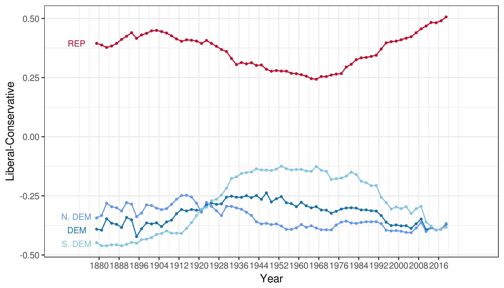
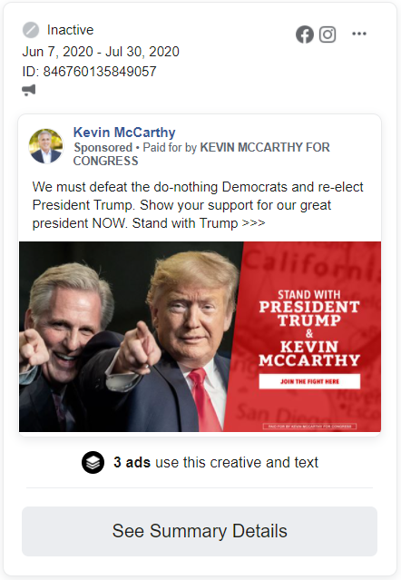
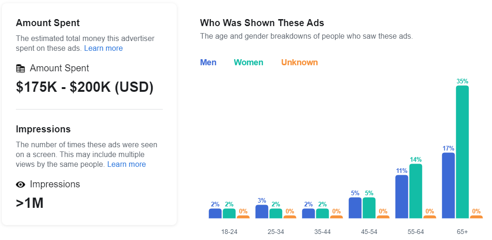

```{r setup, include=FALSE}
knitr::opts_chunk$set(echo = TRUE)
library(tidyverse)
library(readxl)
```

******


## Party Polarization

Over the last decade, America has seen a dramatic increase in its political polarization.  Whether it be through social movements or backlash against them, it seems as if every person in the current day has a strong take on the state of the country.  And this seeming trend doesn't come without warning.  Two important, new additions to everyday life are to blame for a majority of polarization: targeted ads and social media.  Using Facebook, political interest groups have turned a large majority of the population against itself.  These ads always target people most susceptible to their strategies, and get the most impressions and influence off of being controversial.  Simply put, Facebook's targeted ads are being used to polarize a majority of the American population and are a danger to the country itself.


### Party Means on the Liberal-Conservative Dimension, House of Reps



##### [Source](https://voteview.com/articles/party_polarization)


Over time, the ideologies of elected representatives have been getting further and further apart, as it can be seen from the graph provided.  This gap is the greatest it's been since Reconstruction-era America, and it shows a growing difference in political philosophy between the two major parties and their supporters too.  While this trend has been on the rise since the 1970's, one of the largest jumps in ideological differences happens around 2008.  This coincides almost directly with the social media boom, around the same time that Facebook gained their first one hundred million users.[^1]  Ever since this takeoff of social media, targeted ads and polarization have made a clear connection; politicians realized that a new social medium that was consuming much of the public's free time was perfect for gaining otherwise politically-uninvolved voters.


```{r data}
# Source code for reading in database and creating table.
data <- read_excel("funding_polarization.xlsx")

data <- select(data, year, campaign.funding, party.mean.diff.d1, dem.mean.d1, rep.mean.d1)

knitr::kable(
  data,
  col.names = c("Year", "Campaign Digital Spending", "Party Mean Difference", "Dem Mean", "Rep Mean"),
  align = 'r',
  caption = "Digital Campaign Spending | Polarization Numbers from Above Chart",
  format.args = list(big.mark = ',')
)

```


As seen in the data provided above, campaign spending has increased steadily over the past ten years and is predicted to skyrocket by the end of the 2020 election cycle.[^2]  And as spending has steadily increased, so has the mean difference between the two political parties.[^3]  It is fundamental in understanding that this spending is going towards promoting a political campaign through the use of ads, which Facebook allows to target specific audiences very easily.  Through a program called Audience Insights, Facebook allows advertisers to "Learn about people's interests and hobbies", along with stating that Insights "combines relationship status and location to tell you about the types of people interested in your business."[^4]  

From the onset, this might not seem entirely bad, as it gives small businesses the opportunity to grow and promote themselves on a very large platform.  However, this isn't the case with ads based on politics.  As it can be seen on television or other forms of media, political ads are typically malicious and aim to hurt political opponents.  These ads usually never focus on any true statements or logical points, but they instead frame their arguments off of bold opinions and out-of-context quotes.  When these ads are funded with hundreds of thousands of dollars and are then promoted to millions of people, these opinions are thought of as reality by many who are impressionable.  And more times than not, targeted advertising specifically caters itself to the people whose opinions will be verified most by what they see in these ads.  





##### [Source](https://www.facebook.com/ads/library/?active_status=all&ad_type=political_and_issue_ads&country=US&impression_search_field=has_impressions_lifetime&q=trump&publisher_platforms[0]=facebook&sort_data[direction]=desc&sort_data[mode]=total_impressions)[^5]


As an example, the images above show an example of one of these aforementioned ads.  By looking at the ad itself, it's clearly apparent that the ad is attempting to appeal to emotions by using multiple buzzwords to try to grab attention.  Along with this, the targeting data seems to be aimed more towards age groups who are more predisposed to being conservative in this case.  Ultimately, it's garnered over one million views by being pushed for profit, which is Facebook's end goal and the main reason why these disingenuous ads threaten to damage the country if left unchecked.  Ultimately, these dangerous ads  radicalize individuals' opinions of others who differ from them, a major factor in the continual increase of political polarization and hostility countrywide.


## Data Set Sources

Data used in the compiled data set came from two main sources.  [Voteview's historical party polarization dataset (download link)](https://voteview.com/static/articles/party_polarization/voteview_polarization_data.csv) was used for polarization data and the corresponding image.  [A dataset from Borrell Associates on Statista (site link)](https://www.statista.com/statistics/309592/online-political-ad-spend-usa/) was used to track campaign spending in the digital medium.  The footer of this page contains links to those pages, along with links to other sources where information was pulled.


<!-- Footer -->

[^1]: [Number of monthly active Facebook users worldwide as of 2nd quarter 2020](https://www.statista.com/statistics/264810/number-of-monthly-active-facebook-users-worldwide/)

[^2]: [Digital political advertising spending in the United States from 2008 to 2020 (Dataset Used)](https://www.statista.com/statistics/309592/online-political-ad-spend-usa/)

[^3]: [Polarization in Congress (Dataset, Pictures Used)](https://voteview.com/articles/party_polarization)

[^4]: [Facebook IQ Audience Insights](https://www.facebook.com/business/insights/tools/audience-insights?ref=fbb_choose_audience)

[^5]: [Facebook Political Ad Library](https://www.facebook.com/ads/library/?active_status=all&ad_type=political_and_issue_ads&country=US&impression_search_field=has_impressions_lifetime&q=trump&publisher_platforms[0]=facebook&sort_data[direction]=desc&sort_data[mode]=total_impressions)